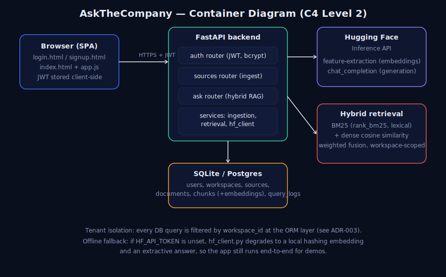

# AskTheCompany Project Documentation

**Enterprise RAG your team can actually verify.**

| Field | Value |
|---|---|
| Segment / problem statement | Segment 5 - LLM Systems & Applied GenAI; Problem E3 - RAG over Enterprise Mess |
| Prepared by | Anushka Jain |
| Date | July 20, 2026 |
| Internship batch | [INTERNSHIP BATCH HERE] |

---

## Table of Contents

1. [Cover Section](#1-cover-section)
2. [Problem Statement](#2-problem-statement)
3. [Objectives](#3-objectives)
4. [System Architecture](#4-system-architecture)
5. [Key Design Decisions](#5-key-design-decisions)
6. [Implementation Summary](#6-implementation-summary)
7. [Testing and Evaluation](#7-testing-and-evaluation)
8. [Known Limitations and Roadmap](#8-known-limitations-and-roadmap)
9. [Conclusion](#9-conclusion)
10. [Appendix](#appendix)

---

## 1. Cover Section

AskTheCompany is a multi-tenant enterprise RAG web app that lets a company
upload messy internal knowledge and ask questions against it with citations,
confidence scoring, role-gated visibility, and audit logging. The project is
positioned for Segment 5 - LLM Systems & Applied GenAI, Problem E3 - RAG over
Enterprise Mess.

The implementation uses a FastAPI backend, vanilla HTML/CSS/JavaScript
frontend, SQLAlchemy with SQLite or Postgres, Hugging Face-hosted embeddings,
optional cross-encoder re-ranking, and a grounded answer-generation path with
offline fallbacks. It is designed as a deployable product prototype rather than
a one-off notebook or script.

---

## 2. Problem Statement

Enterprise knowledge is rarely packaged for clean retrieval. A company may have
policy pages in a wiki, security rules inside PDF files, operational decisions
buried in Slack threads, and employee or vendor facts in spreadsheets. A generic
RAG pipeline that treats every file as plain text can answer simple demos, but
it breaks down in predictable ways when pointed at real company data.

The first failure is chunking. Fixed-size chunks can cut a spreadsheet row in
half, split a Slack thread across unrelated chunks, or detach a policy sentence
from the heading that gives it meaning. When the chunking unit does not match
the source structure, retrieval may find the right words but lose the context
needed for a trustworthy answer.

The second failure is citation quality. Enterprise users do not just need an
answer; they need evidence they can verify. A citation like "source 3" is not
enough when the source is a long PDF or spreadsheet. AskTheCompany therefore
tracks locators that are meaningful for each source type: markdown sections,
PDF pages, Slack channels or threads, and spreadsheet row numbers.

The third failure is permissions. A single-company demo can ignore tenancy and
access control, but a real tool cannot. If multiple workspaces use the same app,
Company A must never retrieve Company B's chunks. Inside a company, broad
sources and restricted sources also need different visibility. For example,
normal employees may query the general handbook, while HR or admins may query a
restricted compensation source.

The real-world scenario is a fictional but realistic company with a messy
knowledge base: HR wiki pages, security PDFs, Slack-style program threads, and
spreadsheet records. AskTheCompany builds a RAG application around that shape
of data rather than assuming every source is a clean paragraph document.

---

## 3. Objectives

### Must-have Objectives Met

| Objective | What was built | Evidence in repo |
|---|---|---|
| Ingest multiple source types | Markdown/text, PDF, Slack-style JSON, CSV, and XLSX have source-specific parsers and citation locators. | `docs/data.md`, ADR-002 |
| Preserve meaningful citations | Citations point to section, page, channel/thread, or row rather than anonymous chunk IDs. | `docs/data.md`, ADR-002 |
| Combine lexical and semantic retrieval | BM25 and dense cosine scores are normalized and fused before final ranking. | ADR-001 |
| Add a precision-oriented second stage | Optional cross-encoder re-ranking scores the top hybrid candidates before returning final citations. | ADR-004 |
| Generate grounded answers | The backend sends retrieved context to Hugging Face generation when available and falls back to deterministic extractive answers when not. | README, ADR-007 |
| Enforce tenant isolation | Retrieval, source listing, and audit log paths are scoped by `workspace_id`. | ADR-003, `docs/test_report.md` |
| Add within-workspace visibility | Sources can be visible to `all`, `admin`, or a custom role such as `hr`. | ADR-005 |
| Handle duplicate revisions | Exact duplicates are rejected; near-duplicates are marked `needs_review`. | ADR-006 |
| Ship as a product prototype | The repo includes auth, frontend, API, tests, docs, Vercel config, Docker config, and demo seeding. | README |

### Stretch Objectives and Roadmap

These items are explicitly documented as future work, not as completed
features:

| Stretch objective | Current status |
|---|---|
| OCR for scanned PDFs | Not implemented. Scanned pages are flagged rather than read. |
| Strong no-answer detection | Not implemented. The evaluation shows 0.0% accuracy on no-answer questions. |
| Per-document ACLs and role management UI | Not implemented. Current ACLs are source-level. |
| Review actions for near-duplicates | Not implemented. The UI surfaces `needs_review`, but keep/supersede actions are future work. |
| Search/index scaling beyond in-process retrieval | Not implemented. BM25 and dense similarity currently scan the workspace corpus in process. |
| Teammate invite flow | Not implemented. The first user creates the workspace admin account. |

---

## 4. System Architecture



The system follows a simple product architecture: a browser-based frontend
talks to a FastAPI backend over HTTPS with a JWT bearer token. The backend owns
auth, source ingestion, retrieval, answer generation, and audit logging. The
database stores users, workspaces, sources, documents, chunks, embeddings, and
query logs. Hugging Face is used for hosted embeddings, optional re-ranking, and
generation when a token is configured.

### Data Flow

1. A user signs up or logs in. The first user in a workspace becomes that
   workspace's admin.
2. The user creates a source, choosing its type and visibility label.
3. Uploaded files are parsed by source-specific chunkers. Each chunk receives a
   citation locator and an embedding.
4. When a question is asked, retrieval first filters chunks by workspace,
   document status, and source visibility.
5. BM25 and dense similarity produce a hybrid shortlist.
6. If enabled, the re-ranker scores the top candidate chunks and orders the
   final `TOP_K`.
7. The answer generator receives only the retrieved context and returns a
   concise answer with citations and confidence.
8. The query is logged for audit and for the Evaluations tab.

### Tech Stack

| Component | Choice | Rationale |
|---|---|---|
| API framework | FastAPI | Typed API layer with automatic OpenAPI docs. |
| Auth | JWT with `python-jose`, password hashing with bcrypt | Stateless sessions without a server-side session store. |
| Permissions | Workspace isolation plus source-level role ACLs | Tenant and role checks happen before scoring or generation. |
| Database | SQLite for local development, Postgres via `DATABASE_URL` for deployment | Zero-config local setup with a production-ready relational path. |
| Lexical retrieval | `rank_bm25` | In-process keyword retrieval without a separate search service. |
| Dense retrieval | Hugging Face Inference API with `BAAI/bge-small-en-v1.5` | Free-tier-friendly hosted embeddings; swappable via environment variables. |
| Re-ranking | Hugging Face cross-encoder, default `BAAI/bge-reranker-base` | Improves ordering of the hybrid shortlist; toggleable for latency. |
| Generation | Hugging Face router, default `meta-llama/Llama-3.1-8B-Instruct` | Open-weight hosted generation with an offline extractive fallback. |
| Frontend | Vanilla HTML/CSS/JavaScript | No build step; static assets served alongside the API. |
| Tests | pytest and FastAPI TestClient | Runs without external services by using deterministic fallbacks. |

### Multi-tenancy and Permissions

The core permission boundary is `workspace_id`. Every tenant-owned row in the
data model carries this key, and retrieval filters on it before any candidate
chunk is scored. This matters because a retrieval bug is more serious than a UI
bug: if a chunk from another workspace reaches scoring or generation, isolation
has already failed. ADR-003 therefore centralizes the boundary at the database
query layer.

Within a workspace, ADR-005 adds source-level role visibility. A source can be
visible to all users, admins only, or a custom role label such as `hr`.
Non-admin users can retrieve only from `all` sources and sources matching their
exact role. Admins can retrieve all sources in their workspace for
administration and audit. This is intentionally source-level rather than
per-document-level; the roadmap calls out finer-grained ACLs and role
management as future work.

---

## 5. Key Design Decisions

### ADR Summary Table

| ADR | Decision | Most important trade-off |
|---|---|---|
| ADR-001 | Use hybrid BM25 plus dense retrieval. | Better recall without external search infra, but `O(n)` corpus scans limit scale. |
| ADR-002 | Use per-source-type parsers and structure-aware chunking. | Better citations and table/thread handling, but more parser code and no OCR yet. |
| ADR-003 | Use workspace-scoped multi-tenancy as the permission model. | Strong centralized tenant filtering, but no Postgres row-level security yet. |
| ADR-004 | Add optional cross-encoder re-ranking over the hybrid shortlist. | Better final ordering, but another hosted model call adds latency and rate-limit risk. |
| ADR-005 | Add source-level role ACLs within a workspace. | Useful role gating with simple schema, but not individual-document ACLs. |
| ADR-006 | Add fuzzy near-duplicate detection with human review. | Catches likely revisions, but review resolution remains manual. |
| ADR-007 | Use Hugging Face embedding, re-ranking, and chat defaults. | Open-weight, swappable models, but hosted inference has latency and availability risk. |

### ADR-001: Hybrid Retrieval

The project rejects pure vector search because enterprise questions often
contain exact identifiers, employee names, policy codes, dates, or vendor names
that dense embeddings may not prioritize. It also rejects pure BM25 because
users naturally ask paraphrased policy questions. The chosen design combines
BM25 and dense cosine similarity, normalizes both score distributions per
query, and weights them with configurable defaults.

The trade-off is operational simplicity versus scale. Running BM25 and dense
similarity in process keeps the project deployable without OpenSearch, Qdrant,
or pgvector. That is appropriate for the internship prototype and a small
workspace corpus. It is not a web-scale search architecture. Once a workspace
exceeds roughly thousands of chunks, the roadmap points toward OpenSearch for
lexical retrieval and pgvector or Qdrant for vector search. See
`docs/adr/ADR-001-hybrid-retrieval.md` for full reasoning.

### ADR-002: Ingestion and Chunking

The project uses source-specific ingestion because a single sliding-window
chunker would damage the evidence structure users need. Markdown is chunked by
heading, PDFs by page, Slack-style JSON by thread, and spreadsheets by row. The
result is that citations can point to a section, page, channel/thread, or row.
Oversized chunks can still fall back to a sliding window, so content is not
silently dropped.

The trade-off is maintenance. Five parsers are more code than one generic
chunker, and OCR is not implemented. Scanned PDF pages are flagged rather than
read. This is an honest scope cut: the project optimizes for meaningful
citations on supported text-bearing sources before adding heavier document
understanding infrastructure. See
`docs/adr/ADR-002-ingestion-and-chunking.md`.

### ADR-003: Permissions Model

The project treats workspace-scoped multi-tenancy as the first permission
boundary. Each company gets a workspace, and every source, document, chunk, and
query log is scoped to that workspace. The retrieval function joins chunks,
documents, and sources and filters by `workspace_id` before scoring. This is
the most important security decision in the repo because it prevents accidental
cross-company retrieval before generation, citations, or logging occur.

The trade-off is that application-layer filters require discipline. A future
endpoint could introduce a bug if it bypasses the centralized retrieval path.
The current app mitigates this through direct tests, especially tenant
isolation tests, and through keeping retrieval as the single path into chunks.
The long-term stronger posture would be Postgres row-level security when the
app moves beyond SQLite. See `docs/adr/ADR-003-permissions-model.md`.

### ADR-004: Cross-encoder Re-ranking

Hybrid retrieval is treated as a recall layer, not the final relevance layer.
ADR-004 adds a second stage: retrieve roughly 20 candidates using the hybrid
score, then score each `(question, chunk)` pair with a cross-encoder re-ranker
before returning the final `TOP_K`. The default hosted model is
`BAAI/bge-reranker-base`, and the feature can be disabled with
`ENABLE_RERANKING=false`.

The trade-off is precision versus latency. Re-ranking usually improves final
ordering because the scorer sees the question and passage together. It also
adds another Hugging Face call per query and cannot recover relevant chunks
that never made the first-stage shortlist. The deterministic fallback keeps CI
and demos working without a token, but it is not equivalent to the live
cross-encoder. See `docs/adr/ADR-004-reranking.md`.

### ADR-005: Document-level ACLs

The implemented ACL design is source-level role visibility. Each source has a
`visible_to_roles` label of `all`, `admin`, or a custom role such as `hr`.
`User.role` remains a string so custom labels can be represented without a
separate teams table. The filter is enforced inside retrieval next to tenant
isolation, so restricted chunks never reach scoring or generation.

The trade-off is granularity. This satisfies the main within-workspace access
need if teams keep restricted documents in restricted sources. It does not yet
support different visibility per document inside the same source, multi-role
grants, or a role-management UI. A join table for grants is the natural future
upgrade if access rules become more complex. See
`docs/adr/ADR-005-document-level-acls.md`.

### ADR-006: Fuzzy Deduplication

Exact duplicates are still rejected with a SHA-256 content hash, but
near-duplicates are handled through human review. The parser first extracts the
same chunk text used for ingestion. The detector then compares the new document
against existing ready documents in the same workspace using SimHash over
three-word shingles and token-count cosine similarity. At a similarity of
`0.92` or higher, the document is stored with `status="needs_review"` and the
matched document ID is recorded in the error field.

The trade-off is conservative safety. The system avoids silently indexing stale
and current revisions side by side, but it also does not decide which version
should win. Review actions such as keep both or supersede old are not built
yet. See `docs/adr/ADR-006-fuzzy-deduplication.md`.

### ADR-007: Model Choice

The hosted model defaults are `BAAI/bge-small-en-v1.5` for embeddings,
`BAAI/bge-reranker-base` for re-ranking, and
`meta-llama/Llama-3.1-8B-Instruct` for answer generation. The reason is not
that these are claimed to be globally optimal; the reason is that they are
open-weight, Hugging Face-accessible, swappable through environment variables,
and practical for a reviewer to run without a local GPU.

The trade-off is that hosted inference is not a production SLA. Network
latency, free-tier cold starts, and rate limits can affect the live model path.
The repo therefore keeps deterministic fallbacks for embeddings, re-ranking,
and generation. ADR-007 explicitly avoids claiming live latency or cost
benchmarks because the synthetic evaluation disabled the Hugging Face token for
reproducibility. See
`docs/adr/ADR-007-embedding-and-chat-model-choice.md`.

---

## 6. Implementation Summary

| Area | What was implemented | Implementation note |
|---|---|---|
| Authentication | Signup, login, logout, and `/api/auth/me` endpoints. | Passwords are hashed with bcrypt; JWTs carry the user ID. |
| Workspaces | One workspace per company signup. | The first user is created as admin for that workspace. |
| Source management | Users can create sources with type and visibility. | Source visibility is set in the frontend Sources tab. |
| Ingestion | Markdown/text, PDF, Slack JSON, CSV, and XLSX uploads. | Each parser emits chunks with source-specific locators. |
| Embeddings | Chunk embeddings stored with chunks. | Hugging Face is used when configured; deterministic fallback is used offline. |
| Exact deduplication | Identical uploads are rejected. | SHA-256 content hash returns a `409` duplicate response. |
| Fuzzy deduplication | Near-identical revisions are marked `needs_review`. | SimHash/token-cosine scoring compares document-level chunk text. |
| Retrieval | Workspace-scoped hybrid BM25+dense retrieval. | Scores are combined in process before optional re-ranking. |
| Re-ranking | Cross-encoder second-stage ordering. | Controlled by `ENABLE_RERANKING`; falls back gracefully without HF access. |
| Generation | Grounded answer generation with citations. | Hosted HF chat path is used when available; extractive answer fallback avoids provider-error crashes. |
| Confidence | Per-answer confidence score. | Current heuristic is relative and known to be poorly calibrated for no-answer questions. |
| Audit log | Queries are logged by workspace and user. | The frontend Evaluations and Audit tabs read from this history. |
| Frontend | Vanilla JS app with login, signup, ask, sources, evaluations, and audit views. | No build step; files are served directly by FastAPI. |
| Deployment | Vercel config, Docker config, and demo seeding. | Vercel discovers `api/index.py`; demo credentials can be auto-seeded. |

The demo workspace documented in the README contains five sources and seven
uploaded documents, including two near-duplicate revision uploads marked
`needs_review`. The demo seed also creates at least 20 query-log entries for
the Evaluations tab.

---

## 7. Testing and Evaluation

### Test Coverage

`docs/test_report.md` documents the core pytest coverage:

| Coverage area | What it proves |
|---|---|
| Signup and login | Workspace creation, user creation, and JWT login work. |
| Duplicate signup and wrong password | Auth rejects invalid or duplicate account flows. |
| Unauthenticated route protection | Protected API routes require a token. |
| End-to-end markdown ingestion and ask | Upload -> chunk -> embed -> ask -> cited answer path works. |
| Exact duplicate rejection | Re-uploading identical bytes returns duplicate protection. |
| Near-duplicate review | A lightly revised policy document is stored as `needs_review`. |
| Different-document handling | A genuinely different document remains ready and searchable. |
| Tenant isolation | Workspace B cannot retrieve Workspace A's chunks. |
| CSV row citations | Spreadsheet rows remain citable by row. |
| Role ACLs | Members cannot retrieve HR-only chunks; admins can. |
| Re-ranking behavior | The re-ranker can reorder a hybrid shortlist. |

The test report states that all documented tests pass as of its last run.
During this documentation generation pass, the current repository test suite
was also run and passed with 15 tests, including later demo-login deployment
coverage.

### Evaluation Methodology

`docs/eval_report.md` is an actual 100-question synthetic evaluation run, not
only a methodology. The runner creates a fresh evaluation workspace, ingests a
fictional corpus across the four supported source families, calls `POST
/api/ask` for each question, and writes detailed outputs under `docs/eval/`.

The evaluation used deterministic keyword scoring over answer text plus
citation previews. No LLM judge was used. The Hugging Face token was disabled
for reproducibility, so these numbers measure the offline fallback and retrieval
path rather than live hosted generation quality.

### Evaluation Corpus

| Source | File | Shape |
|---|---|---|
| People Wiki | `docs/eval/corpus/eval_hr_wiki.md` | 10 heading sections |
| Security PDF | `docs/eval/corpus/eval_security_policy.pdf` | 1 rendered PDF page |
| Slack Export | `docs/eval/corpus/eval_slack_threads.json` | 7 threads |
| HR Roster | `docs/eval/corpus/eval_hr_roster.csv` | 30 employee rows |

The 100 questions are split into 25 factual, 25 multi-hop, 25 table-lookup,
and 25 opinion/no-answer questions.

### Evaluation Results

| Slice | N | Answer accuracy | Citation precision | Citation recall | Avg confidence |
|---|---:|---:|---:|---:|---:|
| Overall | 100 | 66.0% | 34.5% | 65.8% | 93.9 |
| Factual | 25 | 88.0% | 41.3% | 100.0% | 90.2 |
| Multi-hop | 25 | 76.0% | 53.3% | 63.3% | 94.2 |
| Table-lookup | 25 | 100.0% | 43.3% | 100.0% | 95.3 |
| Opinion/no-answer | 25 | 0.0% | 0.0% | 0.0% | 95.8 |

### Confidence Calibration

| Confidence bucket | N | Accuracy | Avg confidence |
|---|---:|---:|---:|
| 80-90 | 22 | 86.4% | 88.2 |
| 90-100 | 78 | 60.3% | 95.5 |

The calibration result is intentionally not softened: confidence is not yet
well calibrated. The highest-confidence bucket performs worse because the
system normalizes scores within each query. If every candidate is weak, the
least bad candidate can still look strong. This directly motivates the roadmap
item for an absolute relevance gate before generation.

### Re-ranking Comparison

The thinking artifact compares the evaluation with re-ranking enabled against
a hybrid-only run:

| Slice | Hybrid-only accuracy | Re-ranking accuracy | Observed effect |
|---|---:|---:|---|
| Overall | 64.0% | 66.0% | Small improvement |
| Factual | 84.0% | 88.0% | Better ordering for direct facts |
| Multi-hop | 80.0% | 76.0% | Slightly worse |
| Table lookup | 92.0% | 100.0% | Strong improvement |
| Opinion/no-answer | 0.0% | 0.0% | No improvement |

The correct interpretation is that re-ranking is useful but not magic. It
helps order candidate evidence, especially for direct factual and row-level
queries. It does not solve no-answer abstention or multi-hop query planning.

---

## 8. Known Limitations and Roadmap

### Known Limitations

| Limitation | Impact |
|---|---|
| No OCR yet | Scanned PDF pages are flagged, not read. |
| Retrieval is `O(n)` in chunk count | The current design is fine for project-scale corpora but not web-scale search. |
| ACL granularity is source-level | Documents inside one source inherit the same visibility. |
| Near-duplicate resolution is manual | The app flags likely revisions but does not yet provide keep/supersede actions. |
| Offline fallback has lower answer quality | Without `HF_API_TOKEN`, embeddings, re-ranking, and generation degrade deterministically. |
| No-answer detection is weak | The 100-question eval scored 0.0% on the no-answer tier. |

### Roadmap for the Next Two Weeks

1. Add OCR for scanned PDFs using Tesseract or PaddleOCR, feeding the existing
   page-aware PDF chunker.
2. Add a relevance/abstention gate before generation so out-of-scope questions
   can return "I do not have enough information."
3. Add finer-grained per-document ACLs and role management UI.
4. Add review workflow actions for near-duplicates: keep both or supersede old.
5. Move BM25 and dense scoring to a real index, such as OpenSearch plus
   Qdrant or pgvector, once a workspace exceeds roughly 5,000 chunks.
6. Re-run the 100-question evaluation with live Hugging Face generation and an
   LLM judge in addition to deterministic keyword scoring.
7. Add an invite-teammate flow for multiple users per workspace beyond the
   founding admin.

These limitations are part of the project's credibility. The current system
demonstrates an end-to-end enterprise RAG product, but the evaluation clearly
shows where production hardening should happen next.

---

## 9. Conclusion

AskTheCompany demonstrates the engineering work behind a credible LLM systems
prototype: structured ingestion, hybrid retrieval, re-ranking, grounded
generation, permission-aware data access, evaluation, and deployable product
packaging. For LLM Engineer, GenAI Engineer, and AI Product Engineer roles, the
project shows not only how to build a RAG app, but how to measure it, document
its trade-offs, and honestly identify the next reliability gaps.

---

## Appendix

### Repository Structure

```txt
asktheco/
|-- README.md
|-- Dockerfile
|-- docker-compose.yml
|-- requirements.txt
|-- vercel.json
|-- api/
|   `-- index.py
|-- backend/
|   |-- requirements.txt
|   `-- app/
|       |-- main.py
|       |-- models.py
|       |-- schemas.py
|       |-- core/
|       |   |-- config.py
|       |   |-- db.py
|       |   `-- security.py
|       |-- routers/
|       |   |-- auth.py
|       |   |-- ask.py
|       |   `-- sources.py
|       `-- services/
|           |-- dedup.py
|           |-- demo_seed.py
|           |-- hf_client.py
|           |-- ingestion.py
|           `-- retrieval.py
|-- frontend/
|   |-- login.html
|   |-- signup.html
|   |-- index.html
|   |-- auth.js
|   |-- app.js
|   `-- styles.css
|-- docs/
|   |-- Project_Documentation.md
|   |-- Project_Documentation.pdf
|   |-- architecture.svg
|   |-- data.md
|   |-- test_report.md
|   |-- eval_report.md
|   |-- thinking_artifact.md
|   |-- resume_bullets.md
|   |-- mock_interview.md
|   |-- adr/
|   |   |-- ADR-001-hybrid-retrieval.md
|   |   |-- ADR-002-ingestion-and-chunking.md
|   |   |-- ADR-003-permissions-model.md
|   |   |-- ADR-004-reranking.md
|   |   |-- ADR-005-document-level-acls.md
|   |   |-- ADR-006-fuzzy-deduplication.md
|   |   `-- ADR-007-embedding-and-chat-model-choice.md
|   |-- demo/corpus/
|   `-- eval/
|       |-- corpus/
|       |-- eval_questions.json
|       |-- eval_results.json
|       `-- eval_summary.json
|-- scripts/
|   |-- run_eval.py
|   `-- seed_demo.py
`-- tests/
    `-- test_basic.py
```

### Links and Submission Details

| Item | Value |
|---|---|
| GitHub repository | https://github.com/Anushkajain-7/Ask-Your-Company.git |
| Live deployed URL | [LIVE DEPLOYED URL HERE] |
| Loom walkthrough | [LOOM LINK HERE] |
| Demo workspace | `Demo Company` |
| Demo email | `admin@demo.com` |
| Demo password | `supersecret1` |

### Source Documents Used

This report consolidates the root `README.md`, all ADRs under `docs/adr/`,
`docs/data.md`, `docs/test_report.md`, `docs/eval_report.md`,
`docs/thinking_artifact.md`, `docs/resume_bullets.md`,
`docs/mock_interview.md`, and the Markdown corpus files under `docs/demo/` and
`docs/eval/`. Evaluation metrics are taken from the documented eval report and
summary files; placeholders are used only where the repo does not contain final
submission information.
